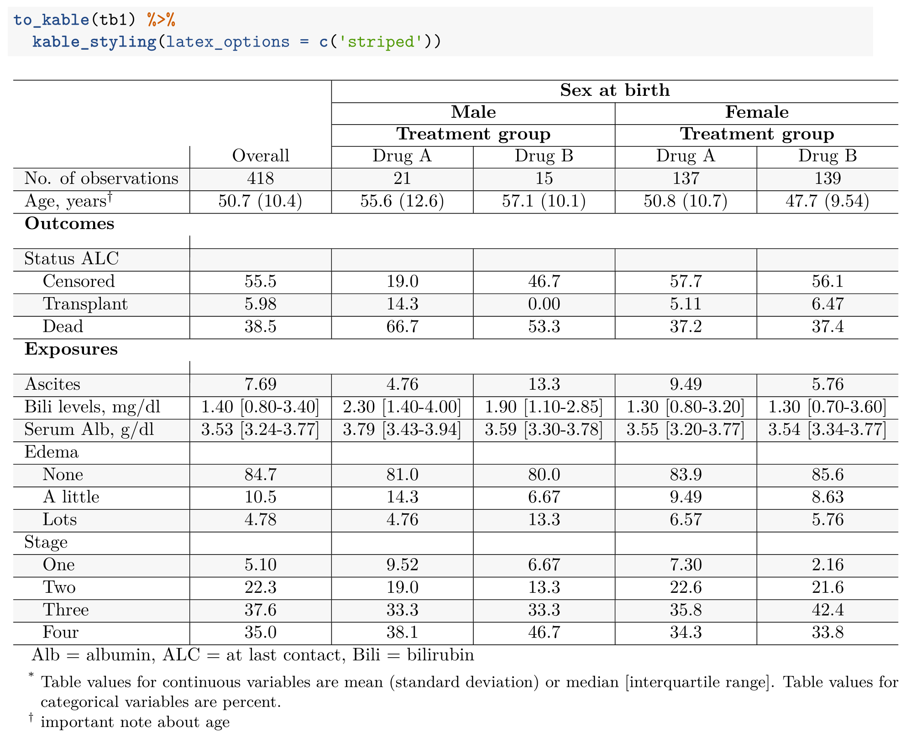

```{r, include = FALSE}

knitr::opts_chunk$set(
  collapse = TRUE,
  comment = "#>"
)

```

# Why use `tibbleOne`?

The goal of `tibbleOne` is to make it easy for analysts to include a Table 1 object in html, LaTeX, and word documents. Notably, this package has far fewer features than the outstanding `TableOne` package and many similar types of R packages for this task, but `tibbleOne` is handy for getting a readable Table 1 into a markdown document with minimal effort.

# Example

The primary function in `tibbleOne` is `tibble_one()`. It is a formula-based function with some flexibility. In the code block below, I'll use `tibble_one()` to tabulate participant characteristics in the primary biliary cirrhosis dataset (adapted from the `pbc` data in the `survival` package). 

First, I make a `meta` dataset that contains data about our data. Initially, I will indicate the labels and groups for variables. In addition to setting groups and labels for variables, I may also want to write some key details about a variable or two, and pass that information into my tables as a footnote. Last, some variable labels have abbreviations in them, and those need to be expanded on in the footnotes of the table.


```{r, message = FALSE}

library(tibbleOne)
library(kableExtra)
library(tidyverse)
library(survival)

data("pbc_tbl1")

# set attributes and then build a meta data set

meta <- pbc_tbl1 %>%
  # labels are used to represent column names in table 1
  set_variable_labels(
    status = "Status ALC",
    trt = "Treatment group",
    age = 'Age',
    sex = 'Sex at birth',
    ascites = 'Ascites',
    bili = 'Bili levels',
    edema = 'Edema',
    albumin = 'Serum Alb'
  ) %>%
  # units must be attached to continuous variables
  set_variable_units(
    age = 'years',
    bili = 'mg/dl',
    albumin = 'g/dl'
  ) %>% 
  # variables in the same group are clustered together table 1
  set_variable_groups(
    Outcomes = c('status'),
    Exposures = c('ascites','bili','albumin','edema','stage')
  ) %>% 
  set_variable_notes(
    age = "important note about age"
  ) %>% 
  set_variable_abbrs(
    status = c(ALC = "at last contact"),
    bili = c(Bili = "bilirubin"),
    albumin = c(Alb = 'albumin')
  ) %>% 
  build_meta()

meta

```

## `meta` data

`meta` data allows `tibbleOne` objects to carry along information that pertains to variable labels, abbreviations, units, and footnotes. Initially, this type of information was stored as an attribute on a `tibble`, but attributes of `tibble` objects can be wiped away by some operations, so it seemed much safer to store the information remotely in a `meta` data object.

```{r}

tb1 <- pbc_tbl1 %>% 
  tibble_one(
    meta_data = meta,
    formula = ~ . | trt*sex,
    specs_table_vals = c(albumin = 'median', bili = 'median'),
    specs_table_tests = c(albumin = 'nopars', bili = 'nopars')
  )

```

## `kable` output

The `kable()` function from the `knitr` package and the host of extra functions from the `kableExtra` package are meant to be combined with `tibbleOne` objects to create publishable tables. A user may pass their `tibble_one()` output into the convenience function, `to_kable()`, to produce a table such as the one below.

```{r}

to_kable(tb1,) %>% 
  kable_styling(bootstrap_options = c('striped', 'hover'))

```

`kable` also provides LaTex tables. 

```{r, echo = FALSE, out.width='650px'}



```

## `flextable` output

The `flextable()` package comprises functions that help construct tables in Microsoft word. `tibbleOne` provides a function to help users send their `tibble_out()` output into the framework of `flextable` package. The function is called `to_word()` 

```{r}

to_word(tb1)

```


# Summary

The example above shows how `tibbleOne` can be used to direct your R output into any of three formats for writing articles (Word, html, and Tex). The code used to create `tibbleOne` tables 

- is formula based, allowing users to create stratified tables with one or two variables (e.g. `sex*trt` for two stratifying variables, `trt` or `sex` for one stratifying variable) 

- gives the user some options for handling continuous variables, such as specifying whether they would like to present mean/median and conduct parametric (t-tests/chi-square) or non-parametric tests (kruskal-wallis) for each variable. 

